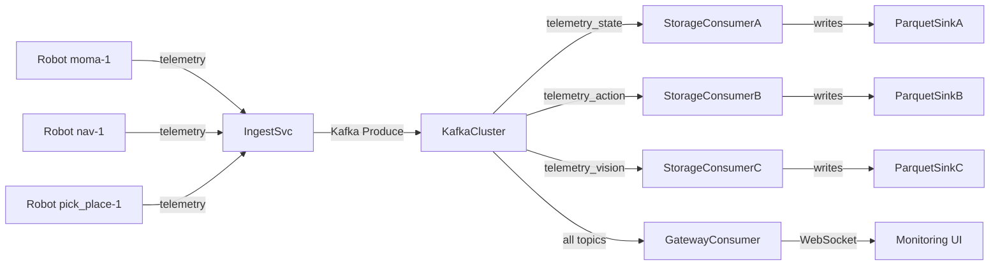

# Telemetry Architecture for Robot Fleets

**Executive Summary:** We propose a **middleware-agnostic telemetry platform** for a heterogeneous robot fleet, optimized for ML and large-scale analytics. Robots emit **typed telemetry events** (state, action, vision, etc.) conforming to a canonical protobuf contract. These events are ingested via HTTP/2/gRPC (with retries, idempotency, and batching) into a **streaming pipeline** (Kafka) that decouples realtime delivery from durable storage. A dedicated ingestion service validates and de-duplicates events, then writes them to Kafka topics (partitioned by robot/task). Downstream, **Storage Workers** consume the stream and write **columnar Parquet tables** (partitioned by modality, robot_id, task_id, date), while a **Realtime Gateway** fans out events to the web UI (WebSocket/SSE). Large blobs (e.g. video frames) are uploaded to object storage (S3/GCS/local) via chunked uploads; telemetry events carry only URIs (often presigned) to these blobs. This design ensures (1) **scalable storage** (Parquet on object store, e.g. via Iceberg for schema evolution)【15†L154-L162】【24†L185-L188】, (2) **real-time monitoring** (Kafka metrics, Prometheus/Grafana)【42†L163-L171】, and (3) **ML-readiness** (explicit `robot_id`, `task_id`, `timestamp`/`sequence_id` allow easy as-of joins and sequence modeling). In short, it is a **data-lake-style telemetry lake** for robots, with strong schema guarantees, security, and operational robustness.

---

## Goals and Non-Goals

- **Goals:**  
  - Ingest **robot telemetry** (joint states, commands, images, events) from any middleware (ROS, proprietary, etc.) into a unified format.  
  - Make data easy for **analytics/ML**: time-aligned, normalized, with explicit identifiers (`robot_id`, `task_id`, `sequence_id`).  
  - Ensure **real-time monitoring** and **batch durability** concurrently.  
  - Support **multiple storage backends** (local disk, S3/GCS, etc.) with configurable routing.  
  - Enforce security (TLS, auth tokens, signed URLs) and reliability (idempotency, retries).  
- **Non-Goals:**  
  - Not a real-time control API. Robots push data out – the system does not send control commands back.  
  - Not tied to ROS or any specific middleware. No ROS types or messages in the schema.  
  - Not a robotic perception stack (no sensor fusion inside this layer). Just transport of sensor/actuator data.  

---

## Canonical Telemetry Schema

### 1. Envelope Fields

All telemetry events share a **strict envelope**. For example (in protobuf syntax):

```proto
message TelemetryEvent {
  string event_id       = 1;       // unique ID (e.g. ULID/UUID)
  int64 event_time_ns   = 2;       // source timestamp (UTC nanoseconds)
  int64 ingest_time_ns  = 3;       // assigned by server on receipt

  string robot_id       = 4;       // e.g. "moma-1", "nav-1"
  string robot_type     = 5;       // e.g. "moma", "nav", "pick_place"
  string task_id        = 6;       // planner-assigned episode ID (defines one trajectory/task)
  uint64 sequence_id    = 7;       // monotonically increasing per (robot_id, task_id, stream_name)
  string schema_version = 8;       // e.g. "v1"

  enum Modality { STATE=0; ACTION=1; VISION=2; EVENT=3; }
  Modality modality    = 9;        // which kind of data this is

  // One logical stream per robot/task/modality (e.g. "joint_states", "camera_front").
  string stream_name   = 10;
  
  // Optional tracing or correlation IDs
  string trace_id      = 11;  
  map<string,string> tags = 12;

  oneof payload {         // typed by modality
    StatePayload  state  = 20;
    ActionPayload action = 21;
    VisionPayload vision = 22;
    EventPayload  event  = 23;
  }
}
```

**Validation rules:** Enforce that `event_id`, `robot_id`, `modality`, `payload` etc. are present. The server **assigns `ingest_time_ns`** on acceptance.  Within each `(robot_id, task_id, modality, stream_name)` stream, `sequence_id` must be strictly increasing (no gaps or duplicates).  The `task_id` serves as the episode boundary (in our system, each planner task ⇒ one `task_id`) and must be used to isolate trajectories.  Arrays in `StatePayload`/`ActionPayload` must have consistent lengths.  Unknown extra fields can be placed in `tags` or `attributes`, not in the core contract.  Oversized payloads (e.g. >1MB) should be rejected.

### 2. Payload Schemas

We use **flexible, vectorized payloads** rather than rigid ROS messages. For example:

```proto
message VectorSignal {
  string name = 1;              // e.g. "joint_1" or "pose" or "temperature"
  repeated string labels = 2;   // labels for each value (same length as values)
  repeated double values = 3;   // data (positions, velocities, etc.)
  string unit = 4;              // e.g. "rad", "m", "unitless"
  string frame = 5;             // optional coordinate frame
}

message StatePayload {
  enum StateType { UNSPEC=0; JOINT=1; BASE=2; CUSTOM=3; }
  StateType state_type = 1;
  repeated VectorSignal signals = 2;
  map<string,string> attributes = 3;
}

message ActionPayload {
  enum ActionType { UNSPEC=0; JOINT_CMD=1; BASE_VEL=2; CUSTOM=3; }
  ActionType action_type = 1;
  repeated VectorSignal signals = 2;
  map<string,string> attributes = 3;
}

message BlobRef {
  string uri = 1;          // e.g. s3://bucket/key or https://...
  string mime_type = 2;    // e.g. "image/jpeg", "video/h264"
  string encoding = 3;     // e.g. "rgb8", "jpeg"
  int32 width = 4;
  int32 height = 5;
  double frame_rate_hz = 6; // for video streams
  uint64 frame_index = 7;   // sequential index within this camera stream
  int64 byte_length = 8;
  string sha256 = 9; 
  map<string,string> attributes = 10;
}

message VisionPayload {
  repeated BlobRef blobs = 1; // can include 1 ref per frame, or more for bursts
  string camera_name = 2;     // e.g. "front_camera"
  map<string,string> attributes = 3;
}

message EventPayload {
  string event_type = 1;         // e.g. "collision", "task_failed"
  enum Severity { INFO=0; WARN=1; ERROR=2; CRITICAL=3; }
  Severity severity = 2;
  string message = 3;
  map<string,string> attributes = 4;
}
```

This schema is **general** yet **self-describing**. It allows any robot to enumerate its joint names or other signals at runtime. The trade-off of using Protobuf is justified by its cross-platform, language-agnostic efficiency【4†L150-L158】. (One could also implement a JSON or flatbuffers variant; but Protobuf’s binary format on HTTP/2 or gRPC gives excellent performance【4†L150-L158】.)  

A complete `.proto` file includes the above messages and should be maintained in a schema registry or version control. Each field must have stable numbering. New fields can be added to payloads or attributes, but never remove or repurpose field numbers (standard Protobuf evolution rules). The `schema_version` field in the envelope tags data to a versioned contract to allow future changes.

---

## Transport Options

Robots post telemetry **batches** or stream via HTTP2/gRPC to the server. We support:

- **HTTP/2 + JSON/Protobuf**: e.g. a POST `/telemetry/event` with a protobuf-encoded or JSON-encoded TelemetryBatch (array of events). HTTP/2 provides multiplexing so robots can pipeline data. 
- **gRPC (HTTP/2)**: define a service like `rpc StreamTelemetry(stream TelemetryEvent) returns (Ack)`. Allows bidirectional streaming if needed (robots send, server ACKs). gRPC auto-generates client stubs for many languages. It also uses TLS by default, and has built-in metadata for auth【4†L159-L166】. 

Because gRPC uses HTTP/2 under the hood, it supports high-throughput, low-latency continuous streams. It also leverages Protobuf natively for serialization. According to Viam’s experience, “gRPC supports... bidirectional streams, allowing systems to send real-time updates... with fast, efficient Protobuf serialization”【4†L150-L158】. And gRPC is *secure by default*: “end-to-end encryption (TLS by default) and authentication capabilities baked in”【4†L159-L166】, which fits our need for secure transport.  

**Batching:** Robots should batch multiple TelemetryEvent messages into a single request (TelemetryBatch) when possible. This reduces HTTP overhead and increases throughput. The ingestion service can accept either single events or batches. Typical batch size might be tens to hundreds of events, or up to a size limit (e.g. 1MB).

**Idempotency & Retries:** Each event carries an `event_id`. This allows deduplication: if a robot retries due to a network failure, duplicate events (with same `event_id`) are detected and discarded. The server responds with a success or error code; on error, clients retry until success (exponential backoff). Using `event_id` and idempotent writes (see Message Bus section) ensures exactly-once ingestion semantics.  

**Delivery Guarantees:** We can accept *at-least-once* delivery (common for streaming). To approach *exactly-once* end-to-end, configure the Kafka producer in the ingestion service as idempotent and transactional (Kafka provides EOS features【41†L1-L9】). In practice, we document that duplicates within a single `(robot_id, task_id, stream_name)` are deduplicated by sequence or event_id logic; out-of-order or missing messages within a task are treated as data loss, to be handled by higher-level re-transmits or gaps in ML datasets.

---

## Ingestion Service Responsibilities

The ingestion microservice (or cluster) performs:

1. **Authentication & Authorization:** Verify robot identity via TLS client certificates, OAuth2/JWT tokens, API keys, or similar. Only allow known `robot_id`/`robot_type` pairs. Reject unauthorized requests.

2. **Schema Validation:** Parse the TelemetryEvent (JSON or binary). Ensure required fields exist and follow rules:
   - `sequence_id` is non-negative and increases.
   - Lengths of arrays in `StatePayload` match the length of `labels`.
   - `event_time_ns` is monotonic per stream (warn if not, but allow slight out-of-order).
   - `timestamp` must be recent (within some skew, or else flagged).
   - If validation fails, reject the batch with error (HTTP 400).

3. **Deduplication:** Keep a short-term cache (e.g. Redis) of recent `event_id`s (or sequence_ids) per `(robot_id,task_id,stream)`. If an `event_id` is seen again, drop it silently (return success without re-processing).

4. **Augment Metadata:** Fill in `ingest_time_ns = now()`. Optionally tag the event with ingest-node ID or sequence if needed.

5. **Write to Message Bus:** Publish each event to the appropriate Kafka topic, using a Kafka producer. Key the message by `(robot_id,task_id)` or by `(robot_id,task_id,stream_name)` so that ordering and partitioning align with robot/task streams. Use a transactional producer or idempotent producer to avoid duplicates【41†L1-L9】.

6. **Acknowledge:** Respond to the client with success/failure. If batch, report per-event result. Ideally respond only after Kafka ACKs, so we know events are durably logged.

7. **Metrics/Logging:** Emit ingestion metrics: events/second, bytes/second, latencies, error rates. Log bad messages.

The ingestion service is horizontally scalable (stateless except for idempotency cache), so we deploy it with multiple replicas behind a load balancer. All replicas share the same Kafka cluster and dedup cache.

---

## Message Bus: Apache Kafka

We use Kafka as a **durable event log** for telemetry. Key design points:

- **Topics:** One topic per modality (or sub-type). E.g. `telemetry_state`, `telemetry_action`, `telemetry_vision`, `telemetry_event`. Alternatively, a single `telemetry_all` topic is possible but harder to manage schemas. Separate topics allow different retention policies or schemas per modality.

- **Partitions:** Partition each topic by `robot_id` (and/or `task_id`). For example, use the Kafka message key = `<robot_id>:<task_id>`. This ensures all events for a given robot task go to the same partition, preserving order within that task. The number of partitions should allow scaling (e.g. 12-24 partitions), and must not exceed the number of parallel consumers in consumer groups.

- **Replication:** Use a replication factor ≥3 for fault tolerance. One leader per partition handles writes; followers replicate.  

- **Retention:** Configure retention based on use case. For most telemetry, we only need a few days/weeks of raw stream (the rest goes to Parquet). Set `retention.ms` (e.g. 604800000 ms = 7 days) or `retention.bytes`. If extremely long retention is needed, consider Kafka’s Tiered Storage (KIP-405) which archives old segments to S3【33†L435-L444】.

- **Compaction:** Enable log compaction on topics only if we want to keep only the latest state per key (e.g. if one robot continuously updates the same state vector and we only care about final state). Otherwise, time-based retention suffices. Log compaction ensures “the log is guaranteed to have at least the last state for each key”【11†L201-L209】, which can be useful for state topics (e.g. to quickly reload the latest joint state for each robot after a restart). However, for training data pipelines we generally want the full history, so compaction is usually disabled (use delete policy). 

- **Delivery Semantics:** Set producers to **idempotent** mode (`enable.idempotence=true`) so that retries do not create duplicates within a partition【41†L1-L9】. If we need atomic writes across multiple topics (e.g. state+event together), use Kafka transactions (`initTransactions()` etc.) so that either all writes commit or none do. Consumers (Storage Writer, Gateway) can use at-least-once (auto-commit or manual commit) semantics since duplicates can be handled upstream by key checks if needed.  

**Kafka Topology Diagram (mermaid):**  

This shows robots pushing to the ingestion service, which writes to Kafka. Dedicated Storage consumers read from each topic and write Parquet. The Gateway consumer reads all topics and pushes to the frontend.

---

## Storage Writer & Parquet

Raw telemetry (post-validated) is persisted as columnar Parquet tables, one per modality. This makes it efficient for analytics and ML training.

### Schemas per modality

We recommend **long-format tables** (one row per time-step per signal). Example Parquet tables:

| **State Table (state)**            |            |            |            |            |            |            |            |
|------------------------------------|------------|------------|------------|------------|------------|------------|------------|
| timestamp (int64)                 | robot_id   | task_id   | stream_name | joint_name | position   | velocity   | effort     |

Each row is one joint (or sensor) measurement at a given event timestamp. For a 6-DOF arm, one TelemetryEvent yields 6 rows (one per joint). This is easy to filter/group by `joint_name` or pivot later.

| **Action Table (action)**         |            |            |            |              |                 |                 |
|-----------------------------------|------------|------------|------------|--------------|-----------------|-----------------|
| timestamp (int64)                | robot_id   | task_id   | action_type | joint_name   | target_position | target_velocity |

Similarly, one row per commanded joint or action vector.

| **Vision Table (vision)**        |           |        |        |       |        |
|----------------------------------|-----------|--------|--------|-------|--------|
| timestamp (int64)               | robot_id  | task_id | camera | uri   | frame_index |

Each row references a frame or blob. The `uri` points to the blob in object storage (local or cloud). Additional columns like `width, height, encoding` can also be stored here or in `attributes`.

| **Event Table (event)**         |            |            |        |--------------|-----------|
|---------------------------------|------------|------------|--------|--------------|-----------|
| timestamp (int64)              | robot_id   | task_id    | event_type | severity     | message   |

Each row is an event notification (collisions, errors, etc.).

These tables capture all needed data in a **columnar, tabular format**. They are easy to load into Pandas, Spark, or ML frameworks. For example, group by `(robot_id, joint_name)` or pivot time vs joints for sequence models. 

### Partitioning and File Layout

To optimize queries, we partition the Parquet dataset by **modality, robot_id, task_id, and date**. Example directory layout:

```
telemetry/state/robot_id=moma-1/task_id=task_123/date=2026-04-09/part-000.parquet
telemetry/action/robot_id=moma-1/task_id=task_123/date=2026-04-09/part-000.parquet
telemetry/vision/robot_id=nav-1/task_id=task_124/date=2026-04-09/part-000.parquet
...
```

This allows filtering data by robot, task, or day without scanning everything. (See Parquet best practices: partition by common query columns【24†L115-L118】, e.g. date or robot_id). We keep partition cardinality modest (date and robot/task yield manageable dirs).  

Within each partition, we batch multiple events into each Parquet file. We aim for **file sizes ~128MB–1GB**【24†L185-L188】. This avoids too many small files, which hurt query performance【24†L185-L188】. For example, flush to disk every ~10000 rows or when time-block ends (e.g. once a minute). We may use a buffer in the storage worker that periodically writes row-groups to Parquet (row-group target ~128MB【24†L98-L100】).

We compress Parquet with Snappy by default (balance speed vs compression). Parquet’s columnar encoding and dictionary/RLE compression is effective for telemetry signals (e.g. many repeated joint names)【24†L137-L140】【24†L179-L187】.

**Schema evolution:**  Over time, we may add new fields (e.g. new sensors). We should use a **table format** (Apache Iceberg, Delta Lake, etc.) on top of Parquet. Iceberg is recommended: it supports evolving columns without rewriting old data【15†L154-L162】. For example, one can add a new column to the State table schema in Iceberg, and old Parquet files need not be rewritten【43†L1-L4】. This also enables “time travel” queries on snapshots.

**Parquet advantages:** Columnar storage, predicate pushdown, and rich metadata make it fast for ML pipelines. (E.g. Spark, Dask, DuckDB will skip irrelevant partitions/row-groups). Using Iceberg or similar means we get ACID table operations and schema versioning【43†L1-L4】.

---

## Blob/Video Handling

Video frames and large sensor data (e.g. depth maps) are handled as **blobs**:

1. **Frame encoding:** On the robot, capture video frames (e.g. from camera). Optionally compress/encode (JPEG, H.264, etc.) to reduce size.
2. **Chunking & Upload:** For large files (video), split into chunks. For example, use AWS S3 multipart upload or HTTP chunked upload. Each chunk might be ~5–10 MB. Upload to the chosen storage (e.g. S3, GCS, or local file server). Compute a checksum (SHA256) per chunk or full file to verify integrity. 
3. **Blob URI:** After upload, we have a stable URI for the file (e.g. `s3://bucket/frame_123.jpg` or `https://storage.company/video_abc.mp4`). If using S3, we can generate a **presigned URL** for secure access (expiring link)【36†L67-L70】.
4. **Telemetry event:** The robot then emits a `TelemetryEvent` (modality=VISION) whose payload includes a `VisionPayload` with a `BlobRef` pointing to the URI, plus metadata (`frame_index`, `camera_name`, etc.). Example:
   ```json
   {
     "timestamp": "...",
     "robot_id": "moma-1",
     "task_id": "task_123",
     "modality": "VISION",
     "stream_name": "front_camera",
     "payload": {
       "blobs": [
         {"uri": "s3://mybucket/moma1/task123/frame_00123.jpg", "encoding": "jpeg", "width": 640, "height": 480, "frame_index": 123}
       ],
       "camera_name": "front"
     }
   }
   ```
5. **Storage of blob metadata:** The Parquet vision table only stores the URI and metadata (not the image bytes). The actual image is kept in S3 (or local disk). This keeps telemetry records lightweight.

**Video vs images:** For continuous video, we can either treat each frame as a separate blob (with `frame_index`), or store short video clips as one blob (in which case `frame_index` is per video file). Either way, telemetry events point to payloads, not raw data. The system should also handle updating an index: e.g. the storage writer could keep an incrementing `frame_id` if needed.

---

## Storage Backends & Routing

We support **multiple backends** for storage. For each modality or data type, the deployment can route to local disk or cloud:

```yaml
storage:
  state:
    backends: [localfs, s3]
  action:
    backends: [localfs]
  vision:
    backends: [s3]
  event:
    backends: [localfs, s3]
```

- **LocalFS:** Write files or Parquet to local directories (`/data/...`), and serve them via an HTTP endpoint if needed (e.g. `file://` URIs). Useful for on-prem or dev.  
- **S3/GCS:** Use cloud object storage URIs (`s3://` or `gs://`). Credentials are managed by the service (e.g. AWS IAM role). Blob uploads use multipart for large files, as above. We ensure data written is consistent (e.g. by writing to a temp prefix and then renaming).  
- **MinIO or S3-compatible:** The same S3 logic applies to any S3-compatible service (with signed URLs, etc.).  

Storage routing is done in the **ingestion/storage pipeline**, not by robots. Robots only send to telemetry, unaware of where data lands. The telemetry service or Storage Worker consults this config to decide where to write. For example, video frames always go to S3, while joint states go to both local and S3 (for redundancy).

**Signed URLs:** When using cloud storage, we avoid exposing internal credentials. Instead, when the frontend needs to fetch a blob, it can request a signed URL. For example, the telemetry service or a separate media service could implement:

```
GET /blob?uri=s3://bucket/path -> HTTP 302 redirect or JSON { "signed_url": "https://...AWSAccessKeyId=..." }
```

This lets the frontend fetch images/videos directly from S3 with time-limited credentials. AWS best practices note that presigned URLs “provide builders with options for efficiently bridging authentication mechanisms”【36†L67-L70】. The telemetry gateway or UI can use these to securely load images without reading blob data through the backend. The backend itself never reads blob contents for serving.

---

## Gateway and Frontend

A **Realtime Gateway** service (or consumer) subscribes to all relevant Kafka topics (as a consumer group). It receives validated TelemetryEvents (same messages as in Parquet) and pushes them to the frontend in real time. Key points:

- **Subscription:** The gateway has a Kafka consumer per topic (or one consumer with all topics). It processes messages **after** ingestion, so events are already validated.  
- **Fanout:** We use WebSocket or Server-Sent Events (SSE) to push updates to connected web clients. For example, a single WebSocket channel may broadcast state and events, or separate channels per robot.  
- **No storage reads:** The gateway **never reads from S3**. If the frontend needs an image, it should use the URI in the telemetry event to fetch from storage (via signed URL if needed). The gateway only serves the metadata.  
- **Low-latency:** This path is tuned for low latency (tens of ms) to drive dashboards or operator UIs. It can be scaled by partition (e.g. multiple gateway replicas as Kafka consumers, each handling a subset of robots).  

**Frontend patterns:** The web UI can subscribe via WebSocket and receive streams of JSON telemetry. For video frames, the payload contains an image URI; the frontend can issue a fetch or use `` with a presigned link to load it. For state/action, display charts or robot model states. The UI treats each `(robot_id, task_id)` separately (like tabs or graphs per robot). Authentication on the frontend (dashboard login) is separate from robot auth.

---

## ML Dataset Alignment

For downstream ML (imitation learning, forecasting, etc.), we build datasets by **time-aligning modalities**:

- Use `task_id` (episode) to segment trajectories. Do not join data across different `task_id`s.  
- Within an episode, order by `(event_time_ns, sequence_id)`. The `sequence_id` handles any clock jitter or same-timestamp ordering.  
- The typical data pair is `(state_t, action_t+Δt)` or `(state_t, next_state_t+Δt, reward_t, ...)`. We interpret actions as applying to the interval after state time. For example, if a joint command arrives at 10.0s, we consider it as controlling `[10.0, next)`. The training input could be (state@9.0s, action@10.0s) => (state@10.0s).  
- **As-of joins:** To merge state and action streams, perform an “as-of” join on time within the same `task_id`. In Pandas or Spark, this is like `state_df.merge_asof(action_df, on='timestamp', by='task_id', direction='backward')`. This ensures we don’t assume fixed frequency; even if no action was sent for 0–10s, the next action will pair with the last state at 10s.  
- Add a `sequence_id` column (monotonic index within episode) to simplify sequence modeling. You may drop event_time after sorting, as long as order is kept.  
- Provide a `success` or `reward` column (from events) keyed by episode to enable supervised RL or outcome prediction.

Because we normalized the tables (long format, with episode IDs), it’s straightforward to filter and join them. Robot-specific differences (like number of joints) are abstracted: each row has its `joint_name`, so ML models can handle variable numbers or even use padded tensors. 

---

## Monitoring and Alerting

We must monitor every component:

- **Ingestion Service:** Count of events ingested, validation errors, average latency. Expose Prometheus metrics (or push to monitoring) on throughput and error rates.
- **Kafka Cluster:** Use **JMX exporter** on brokers. For example, scrape metrics like BytesIn/BytesOut per topic, MessagesInPerSec, UnderReplicatedPartitions (critical), Consumer Lag【42†L163-L171】. Grafana can display broker load, topic throughput, and consumer lag (especially storage writer lag).  
- **Storage Workers:** Track file write throughput, Parquet write successes/failures, backlog of events (should be near zero if consumers are healthy).  
- **Gateway:** Monitor WebSocket connections, event dispatch latency, any failures.  
- **Health Checks:** All services expose `/health` endpoints. Use an orchestrator (e.g. Kubernetes) to restart failing pods.  
- **Alerts:** Alert on errors in ingestion, Kafka offline, high under-replicated partitions, consumer lags > threshold, or storage issues (disk full, S3 errors).  

These practices align with standard Kafka monitoring and cloud observability. For example, the *OneUptime* tutorial shows using JMX exporter on each broker and routing to Prometheus/Grafana【42†L163-L171】. We should ensure all telemetry services emit Prometheus-format metrics (via endpoints or push gateway) for easy integration.

---

## Security

- **TLS Everywhere:** All client-server (robot→ingest, service→Kafka (SSL), gateway→frontend (WSS)) connections use TLS. gRPC by default requires TLS, and HTTP2 endpoints should use HTTPS. This encrypts telemetry in flight【4†L159-L166】.  
- **Authentication:** Robots authenticate using API keys or mTLS certificates. The ingestion service verifies these and maps them to `robot_id`. The frontend/API gateway likewise requires login tokens (JWT/OAuth) for admin access.  
- **Authorization:** Check that a robot only publishes with its own `robot_id`. The service can enforce `robot_type` consistency (e.g. only “moma” class robots use MOMA message schema).  
- **Signed URLs:** As noted, any access to blobs in S3/GCS should use signed URLs that expire quickly. This prevents untrusted clients from grabbing data indefinitely. AWS suggests short lifetimes and use of `X-Amz-Expires` signatures【36†L67-L70】.  
- **IAM and Bucket Policies:** On cloud backends, use IAM roles or service accounts for the telemetry services. Lock down storage buckets so only the service principal can write/read, and ensure encryption at rest (SSE) is enabled.  
- **Network:** If on Kubernetes, run services in a private VPC or subnet, with ingress only through the exposed API. Use network policies/firewall to restrict Kafka ports.  
- **Auditing:** Log security-relevant events (failed auth, ACL violations) and send to a SIEM or log service.  

The gRPC blog notes that gRPC’s built-in TLS and auth features mean we don’t have to bolt on security manually【4†L159-L166】. In practice, you might use client certificates or TLS PSK or OAuth2 tokens in metadata. The key is: require trusted identity for every telemetry message.

---

## Testing Strategy

We must rigorously test each part:

- **Schema Validation:** Unit tests that invalid TelemetryEvents are rejected. E.g. missing fields, mismatched array lengths, out-of-order sequence. Use a JSON schema or Protobuf validation library in CI.  
- **Dedup/Idempotency:** Test that sending the same `event_id` twice results in only one write to Kafka/parquet. Simulate re-sending on failure.  
- **Ordering:** For a given `(robot_id,task_id)`, send events with out-of-order `sequence_id` or timestamps and confirm the service enforces order (either buffering or rejecting).  
- **Load/Performance:** Stress-test ingestion with high rate (e.g. 10k events/sec) to ensure Kafka and writer scale. Measure latency from ingest to Kafka, and through to Parquet.  
- **Fault Tolerance:** Bring down Kafka broker, storage node, etc., and ensure the system recovers (with possibly brief downtime). Test that in-flight events during failures are not lost or duplicated.  
- **End-to-End:** Simulate a robot run: emit joint states, actions, images, events; then attempt to reconstruct a trajectory from the stored data and feed into a simple ML model.  
- **Security Tests:** Verify TLS handshake, try to send with wrong robot_id or invalid token and ensure rejection. Verify signed URL expiration.  

Automated CI pipelines should run these tests. For example, Docker-compose or Kubernetes in “dry-run” mode can deploy a mini Kafka+Zookeeper, ingestion service, and test with real Kafka producers/consumers. Use tools like [kafka-python](https://pypi.org/project/kafka-python/) or Confluent Kafka clients to simulate producers/consumers. 

---

## Operational Runbook

- **Deployment:** All services (Ingest, Kafka, Storage Workers, Gateway) run in containers or VMs. Kafka is a cluster of 3+ brokers. Use an orchestrator (Kubernetes or ECS) for scalability. The ingestion and storage workers can scale horizontally.  
- **Scaling:** Monitor load. If ingress rate increases, add more Ingestion replicas and Kafka partitions/consumers. Ensure zookeeper/KRaft quorum is healthy. Use Kafka’s auto-rebalance for new partitions.  
- **Failure Modes:**  
  - *Ingestion down:* Prometheus alert and auto-restart; since Kafka is persisted, new events buffer at robots or fail fast.  
  - *Kafka broker down:* Data is unavailable for that broker’s partitions, but replicas should take over if ISR is ≥2. If multiple brokers down, impact. Set alerts on UnderReplicatedPartitions【42†L163-L171】.  
  - *Storage writebacklog:* If Parquet writer lags (e.g. heavy load), consumer lag will grow. Alert if lag > threshold. Consider adding more storage worker instances.  
  - *Storage full:* If disk runs out (in local mode), alert and fail; ideally switch to cloud. Monitor disk usage via node metrics.  
  - *Clock skew:* If `event_time_ns` is far in future/past, ingestion rejects or warns; robots should NTP-sync.  
- **Upgrades:** Use rolling restarts with zero downtime. For Kafka, add new nodes with broker replacement, migrate partitions (kafka-reassign-partitions). For Parquet schema changes, use Iceberg’s alter table.  
- **Backups:** For critical telemetry, use Kafka’s Tiered Storage or backup HDFS. Parquet files on S3 inherently durable; local mode may need a backup process.  

In summary, document runbook steps: “If Kafka is unhealthy, check disks, ZooKeeper or KRaft logs, restart affected broker.” “If ingestion lag grows, increase partition count.” etc.

---

## Implementation Prompt for LLM

Finally, to automate parts of this, here is a **copy-paste prompt** you could give to an LLM like Claude Opus to implement key components:

```
Build a production-ready, middleware-agnostic telemetry system for a robot fleet.

Requirements:

1. Define a protobuf-based TelemetryEvent schema (as above) and a TelemetryBatch containing repeated events.

2. HTTP/gRPC API: 
   - Support POST /telemetry/event for JSON/Protobuf TelemetryBatch.
   - Support gRPC streaming TelemetryEvent (bidirectional or client-only stream).
   - Enforce TLS.

3. Ingestion logic:
   - Validate envelope fields and payload structure.
   - Ensure sequence_id is monotonic per (robot_id,task_id,stream_name).
   - Deduplicate using event_id.
   - Assign ingest_time_ns.
   - Publish events to Kafka topics (telemetry_state, telemetry_action, etc.) keyed by robot_id/task_id.

4. Kafka setup:
   - Topics for each modality, partitioned by robot_id.
   - Replication factor >=3, retention 7 days, compaction on state topic if used.
   - Use idempotent producer and transactions for exactly-once writes.

5. Storage consumers:
   - Kafka consumer group that reads each topic.
   - Writes to Parquet: one row per vector element.
   - Partition Parquet by robot_id, task_id, date.
   - Aim for ~256MB row-groups.
   - Use Snappy compression.
   - Evolve schema safely (e.g. via Iceberg).

6. Vision blob service:
   - Endpoint to upload video frames (accept chunks).
   - Store in local or S3 storage, return URI.
   - Telemetry event includes the URI (no image bytes in event).

7. Gateway:
   - Kafka consumer that pushes events to frontend via WebSocket or SSE.
   - No blob data in gateway.

8. Frontend:
   - Connect via WebSocket, parse events.
   - For vision URIs, fetch images (presigned URL if cloud).

9. Security:
   - Enforce TLS on APIs.
   - Use API keys or tokens to authenticate robots.
   - Generate presigned URLs for S3/GCS blobs.

10. Monitoring & Testing:
   - Expose Prometheus metrics (ingest rate, latencies, Kafka lag).
   - Write tests for schema validation, dedup, ordering.
   - Document alerts (e.g. Kafka under-replicated partitions).

```

By following this design, your fleet will have a robust, scalable telemetry backend that is **agnostic to robot middleware** and ideal for downstream data science. 

**References:** Core concepts from Kafka’s design (compaction & retention)【11†L201-L209】, Parquet best practices【24†L185-L188】, and modern robotics comms (gRPC/Protobuf)【4†L150-L158】 informed this architecture.